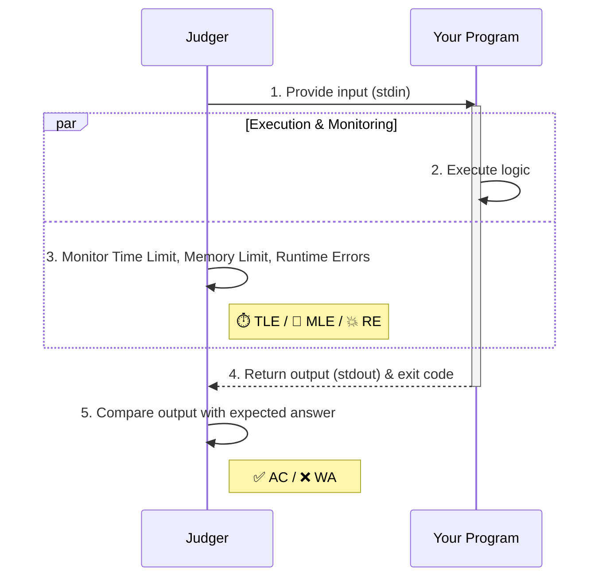
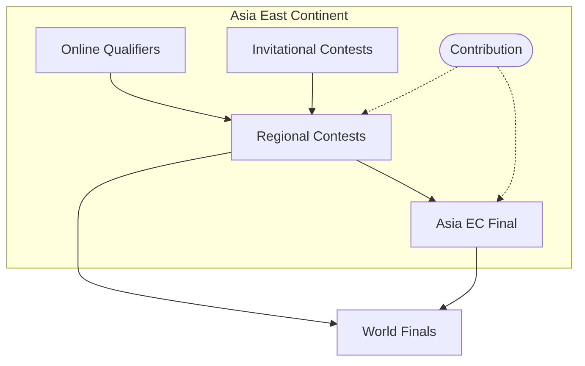
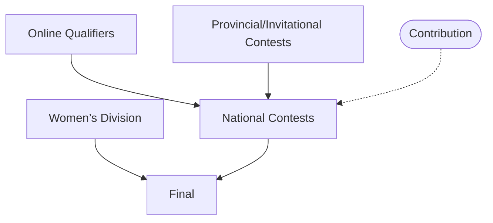

# Info Session 2026

HKU Competitive Programming Team

YANG Mingtian (@skylee)

---

# Agenda

| Section | Topics |
| :--- | :--- |
| **1. Competitive Programming** | What is CP? · Why do it? · Anatomy of a Problem |
| **2. Major Contests** | ICPC · CCPC · ACM-HK PC |
| **3. HKU CP Team** | Achievements · Selection · Training & Resources |

---
layout: section
---

# Competitive Programming

## The “Olympics of Programming”

---

# What is Competitive Programming?

- Solving algorithmic problems with code under **time pressure**
- Core competencies:
  - Coding
  - Mathematical modelling
  - Data structures & algorithms
  - Teamwork
  - Decision‑making

> It's not just coding — it's **problem‑solving under constraints**.

---

# Anatomy of a Contest Problem

| Component | Why it matters |
| :--- | :--- |
| 📖 **Problem Description** | The story. Extract the underlying problem. |
| 📥 **Input / Output Spec** | Exactly what to read and print. |
| 🧪 **Sample I/O** | A sanity check for your understanding. |
| ⏱ **Time Limit** | Tells you how fast your algorithm must be. |
| 🧠 **Memory Limit** | Tells you how much space you can use. |

> 💡 **Pro tip**: Read the **Constraints** first — they dictate your algorithm choice.

---

# Judger-Program Interaction



---
layout: two-cols-header
---

# Sample Problem: [Forming Quiz Teams](https://vjudge.net/problem/UVA-10911)

**Time Limit:** 3000 ms · **Memory Limit:** 256 MB

Let $(x, y)$ be the integer coordinates of a student’s house on a 2D plane. There are $2N$ students and we want to pair them into $N$ groups. Let $d_i$ be the distance between the houses of 2 students in group $i$. Form $N$ groups such that $\mathit{cost} = \sum_{i = 1}^N d_i$ is minimised.

::left::

### Input
- First line: integer $N$ ($N \le 8$).
- Next $2N$ lines: integers $x$ and $y$ ($0 \le x, y \le 1000$).

### Output
- A single floating‑point number: the minimum cost.
- Printed with **exactly 2 digits** after the decimal point.

::right::

### Sample Input

```
2
1 1
8 6
6 8
1 3
```

### Sample Output

```
4.83
```

<style>
.two-cols-header {
  display: grid;
  grid-template-columns: 6fr 4fr;
  column-gap: 20px;
}
</style>
---

# Contestant Personae

| Persona | Mindset & Action | Outcome |
| :--- | :--- | :--- |
| Novice | Tries greedy → **WA**. Tries naïve backtracking → **TLE**. | ❌ Fails |
| Theorist | Recognises it as “matching” but does not know how to solve it. | ❌ Gives up |
| Grinder | Uses bitmask DP but struggles with debugging. | ❌ Too late |
| Pro | Uses bitmask DP. Codes correctly in a few tries. | ✅ AC |
| Legend | Uses bitmask DP. Flawless implementation in minutes. | ✅ AC |

### Key Takeaway

- **Correctness** alone is not enough — you need **speed** too.
- **Knowing the theory** is just the first step.
- **Bug‑free coding** under pressure is what wins contests.

---

# Why Do Competitive Programming?

- 🧠 Sharpen your algorithmic thinking and coding skills
- 🤝 Meet like‑minded peers
- 📄 Boost your CV – top tech companies value ICPC participants
- 🌍 Compete globally against the best
- 🎓 Strengthen your profile for graduate school

---
layout: section
---

# ICPC

## International Collegiate Programming Contest

The world’s largest and most prestigious university‑level programming contest.

---
layout: iframe
url: https://icpc.global/regionals/finder
---

---

# ICPC Format & Rules

| Aspect | Detail |
| :--- | :--- |
| ⏱ Duration | 5 hours |
| 📝 Problems | 10–13 |
| ✅ Judging | Real‑time, fully automated |
| ⏲ Penalty | +20 minutes per wrong submission |
| 🏆 Ranking | 1. More solved problems → higher rank <br/> 2. If tied, lower total penalty time wins |

---

# ICPC Asia EC Advancement Path


---
layout: section
---

# CCPC

## China Collegiate Programming Contest

China’s own ICPC

---

# CCPC vs ICPC: Key Differences

- Language (since 2024)
  - Statements are **Chinese-only**.
- Scoreboard (since 2026):
  - Problem IDs are initially **hidden**.
  - They are revealed gradually as AC rates hit thresholds.
  - All PIDs become visible after the freeze.

---

# CCPC Advancement Path



---
layout: section
---

# ACM-HK<br/>Programming Contest

Hong Kong’s own ICPC

---

# ACM-HK PC vs ICPC

- ⏱ Duration: 4 hours vs 5 hours
- 📝 Number of problems: 8–11 vs 10–13
- 🧗 Structure: single-tier vs Multi-tier

---
layout: two-cols-header
---

# Season 2026–27: Upcoming Contests

::left::

### ICPC
- **Xi’an Regional:** 17–18 Oct
- **Chengdu Regional:** 24–25 Oct
- **Wuhan Regional:** 31 Oct – 1 Nov
- **Nanjing Regional:** 7–8 Nov
- **Shenyang Regional:** 14–15 Nov
- **Shanghai Regional:** 5–6 Dec
- **Nanchang Regional:** 19–20 Dec
- **Hong Kong Regional:** 9–10 Jan 2027
- **Asia EC Final:** 26–28 Jan 2027
- **World Finals:** TBA (Sept 2027)

::right::

### CCPC
- **Changchun National:** 17–18 Oct
- **Women’s Division:** 24–25 Oct
- **Leshan National:** 7–8 Nov
- **Jingzhou National:** 14–15 Nov
- **Xiamen National:** 21–22 Nov
- **Final:** TBA (late Apr / early May)

### ACM-HK PC
- TBA (mid-June)

---
layout: section
---

# HKU Competitive Programming Team

a.k.a. Provinci

---

# Who We Are

HKU's official team in major CP contests, including

- **International Collegiate Programming Contest** (ICPC)
- **China Collegiate Programming Contest** (CCPC)
- **ACM-HK Programming Contest**

---

# Recent Achievements

## ICPC

- 🏅 **2025** (49th) WF @ 🇦🇿 Baku: 40th Place
- 🏅 **2024** (47th) WF @ 🇪🇬 Luxor: 36th Place

## CCPC

- 🥇 **2018** (4th) Final @ Shenzhen: Gold Medal (5th Place)

## ACM-HK Programming Contest

- 🥉 **2026**: 3rd Place
- 🥇 **2025**: 1st Place
- 🥉 **2024**: 3rd Place

---

# Selection Contest

- **Practice Contest:** 19 Sept (Sat), 19:30–20:30
- **Real Contest:** 20 Sept (Sun), 19:00–21:30
- **Venue:** CBA, G/F, Chow Yei Ching Building
- **Format:** Individual ICPC-style contest

### What to Expect

- We plan to form **4 ICPC teams** and **2 CCPC teams**.
- Some **self‑funded ICPC teams** may also be possible.
- Numbers may be adjusted based on budget and selection results.

### Rules
- 📄 Only paper materials are allowed.
- 💻 Bring your own laptop with a screen recorder (e.g., Zoom).

---

# Eligibility

### ICPC (Simplified)

- You began your post‑secondary studies in **2022 or later**, **or** you were born in **2003 or later**.
- You have competed in **fewer than 5** ICPC regional seasons.
- You have competed in **fewer than 2** World Finals.

> ⚠️ This is a **simplified summary**. The complete eligibility rules are subject to [official ICPC rules](https://icpc.global/regionals/rules).

### CCPC

- You are an undergraduate student.

### ACM-HK PC

- You are eligible for ICPC 2026–27.

---
layout: two-cols-header
---

# How to Get Started with CP?

### Prerequisites

- Basic C++ (e.g., COMP2113)
- Basic DSA (e.g., COMP2119)
- Basic Discrete Maths (e.g., COMP2121)

### Textbooks

::left::

- [Competitive Programming 4](https://cpbook.net/)
  <div class="flex items-center gap-4">
    
    
  </div>
- [USACO Guide](https://usaco.guide/)

::right::

- [算法竞赛入门经典](https://book.douban.com/subject/25902102/) & [算法竞赛入门经典：训练指南](https://book.douban.com/subject/35431537/)
  <div class="flex items-center gap-4">
    
    
  </div>
- [OI Wiki](https://oi.wiki/)

---

# Practice Platforms & Archives

### Online Contests / Problem Sets

- [Codeforces](https://codeforces.com/)
- [AtCoder](https://atcoder.jp/)
- [洛谷](https://www.luogu.com.cn/)

### Past XCPC Problem Archives

- [Codeforces Gym](https://codeforces.com/gyms)
- [QOJ](https://qoj.ac/)

---

# What’s Next?

- 🌐 **Visit our website**\
  https://i.cs.hku.hk/~provinci/
- 📝 **Register for the selection contest**\
  https://hku.au1.qualtrics.com/jfe/form/SV_emQnQ5Lwci2BWVU
- 📬 **Subscribe to our Google Group**\
  hkucpc+subscribe@googlegroups.com

---
layout: end
---

See You at the Contest! 🚀
